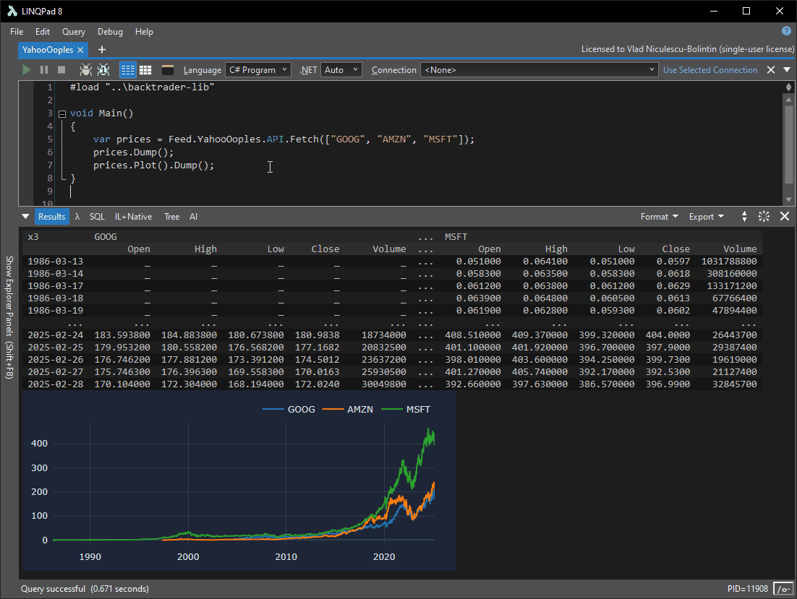
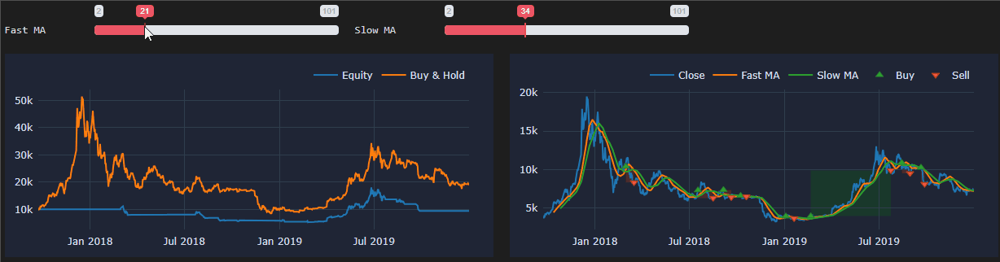

# BacktraderLib

**BacktraderLib** is a simple to use, yet powerful framework for fetching market data, build trading algorithms and backtest them.

It's very much a work in progress still. But some abstractions are coming along nicely already.

## Features

- Fully integrates into LINQPad
- Market data feeds: TwelveData, Yahoo, post-no-preference Dolt database
- Nested dataframes with support for pretty printing and plotting
- Indicators using [TA-Lib](https://github.com/hmG3/TA-Lib.NETCore)
- Broker simulation
- Custom [Plotly.js](https://plotly.net/) integration with fast updates
- System.Reactive based variables to easily create dynamic UIs


## Screenshots

| 
|:--:| 
| *Dataframes & Feeds* |

| 
|:--:| 
| *Visualize* |


## Usage

Here's the implementation of the DMAC algorithm and visualization in the gif above:

```c#
// I have yet to include this common script in the repo
// along with some LINQPad demo scripts.
// The main thing this script does is
//   - reference the BakctradingLib and the Feed.XXX packages
//   - call BacktraderLibSetup.Init() in LINQPad void OnStart() hook
//   - provide some already saved market data: Prices.Load(Data.Btc)
#load "..\backtrader-lib"
using Obs = System.Reactive.Linq.Observable;
using static BacktraderLib.CtrlsUtilsStatic;


static readonly BrokerOpts 					brokerOpts	= new() { Cash = 10000 };
static readonly	Frame<string, string, Bar>	prices		= Prices.Load(Data.Btc);
const			int							TimeOfs		= 0;
static readonly	string						Sym			= prices.Single().Name;


sealed record Meta(int PeriodFast, int PeriodSlow);
sealed record Out(
	SimResult SimResult,
	Frame<string, string> MaFast,
	Frame<string, string> MaSlow
) : IWithSimResult;


static Out Run(Meta meta)
{
	var maFast = prices.Get(Bar.Close).SMA(meta.PeriodFast);
	var maSlow = prices.Get(Bar.Close).SMA(meta.PeriodSlow);
	var (entrs, exits) = maFast.Crossover(maSlow);
	var result = Sim.Run(
		prices,
		TimeOfs,
		brokerOpts,
		[maFast, maSlow],
		ctx =>
		{
			ctx.WhenTick.Subscribe(t =>
			{
				if (!ctx.IsReady[Sym]) return;
				
				switch (ctx.Positions[Sym])
				{
					case 0:
						if (entrs[Sym].Values[t].IsTrue())
						{
							var size = ctx.Cash / prices[Sym][Bar.Close].Values[t];
							ctx.Buy(Sym, size, OrderType.Market);
						}
						break;

					case > 0:
						if (exits[Sym].Values[t].IsTrue())
						{
							var size = ctx.Positions[Sym];
							ctx.Sell(Sym, size, OrderType.Market);
						}
						break;

					case < 0:
						throw new ArgumentException("Impossible");
				}
			});
		}
	);
	return new Out(
		result,
		maFast,
		maSlow
	);
}

void Main()
{
	var Δsym = Var.Make(Sym);
	var (ΔperiodFast, periodFastUI) = Ctrls.IntSlider("Fast MA", 30, 2, 101);
	var (ΔperiodSlow, periodSlowUI) = Ctrls.IntSlider("Slow MA", 31, 2, 101);
	var Δout = Var.Expr(() => Run(new Meta(ΔperiodFast.V, ΔperiodSlow.V)));

	var plotSym = Δout.ToSymbolPlot(
		Δsym,
		prices,
		(o, s) => [
			o.MaFast[s].ToTrace("Fast MA"),
			o.MaSlow[s].ToTrace("Slow MA"),
		]
	);
	var plotEqu = Δout.ToEquityPlot(prices);
	
	vert([
		horz([
			periodFastUI,
			periodSlowUI,
		]),
		horz([
			plotEqu,
			plotSym,
		]),
	]).Dump();
}
```


## Links
- [License](./License.txt)
- [Development Guide](./DevelopmentGuide.md)
